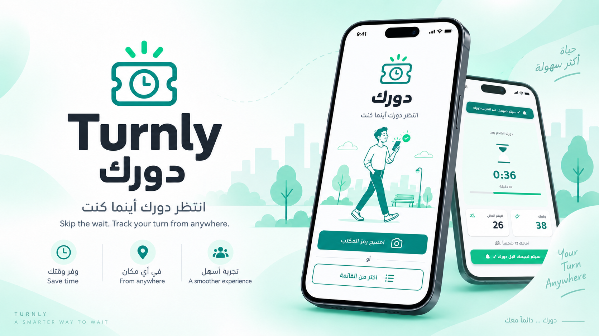
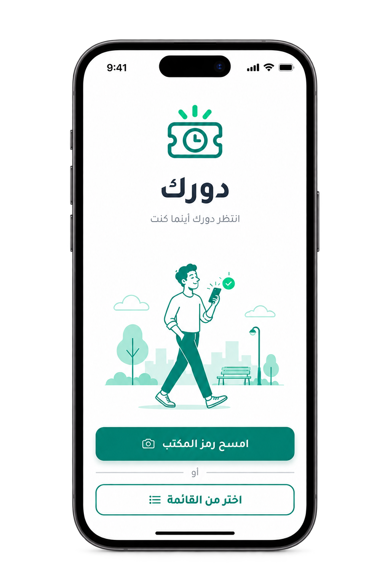
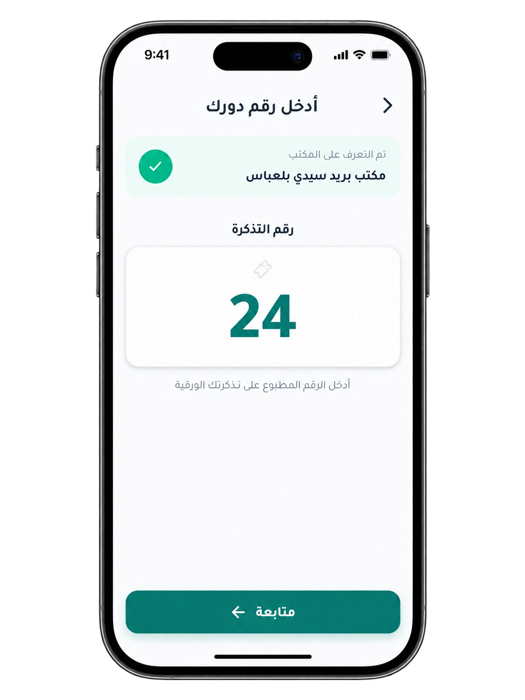
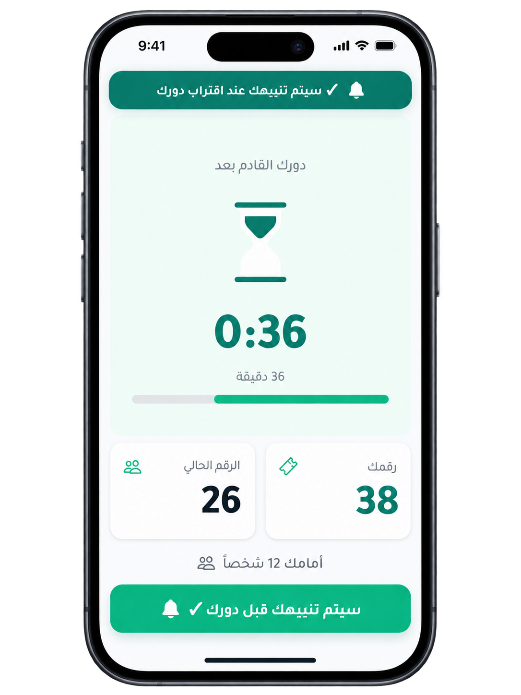
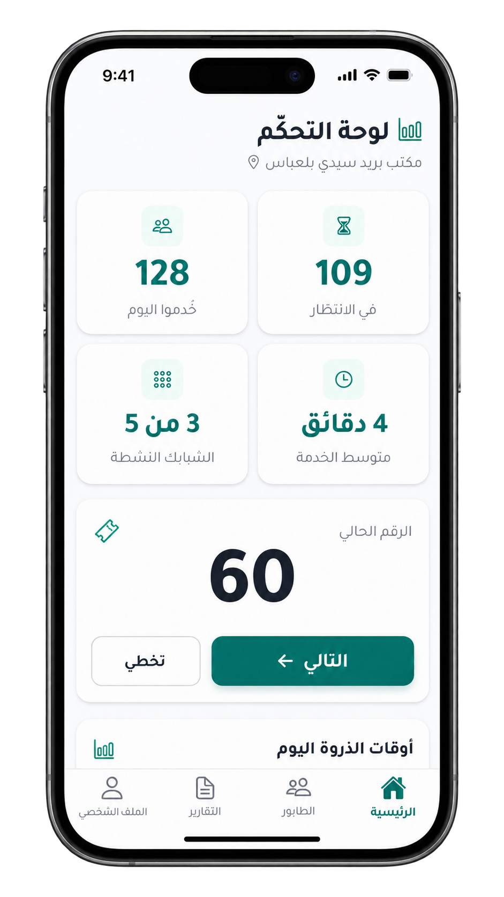

<br />

# Turnly — دورك

### انتظر دورك أينما كنت &nbsp;·&nbsp; Skip the wait. Track your turn from anywhere.

<p>
  
  
  
  
</p>

---

## About

In Algeria and across the Arab world, millions of people visit government offices and post offices every day — only to wait for hours with a paper ticket, afraid to step outside in case their number is called. There is no way to know how close your turn is without being physically present in the queue.

**Turnly** solves this. Citizens take a paper ticket as usual, enter their number in the app, and then leave freely — tracking their real-time queue position and estimated wait time from anywhere. A smart in-app notification alerts them when their turn is approaching so they can return just in time.

---

## ✨ Features

- **QR scan or manual office selection** — Simulates scanning the office QR code, or lets the citizen pick from a list of branches.
- **Paper ticket entry** — Enter your existing paper queue number; no new process, no hardware changes needed.
- **Live queue tracking** — See your ticket number, the current serving number, how many people are ahead, and a real-time countdown to your estimated wait time.
- **Smart proximity alert** — Receive an animated in-app notification when fewer than 5 people remain ahead of you.
- **Employee dashboard** — A separate, access-controlled screen where staff control the queue manually with "Next" and "Skip" actions, a live stats panel, and a peak-hours chart.
- **Shared real-time state** — The citizen tracking screen and the employee dashboard share the same queue state in real time — advancing the queue on the dashboard instantly reflects on the citizen's screen.
- **Full Arabic RTL support** — Built from the ground up for right-to-left Arabic, with the Tajawal typeface and correct RTL layout throughout.

---

## 📱 Screenshots

<table>
  <tr>
    <td align="center"><b>Welcome</b></td>
    <td align="center"><b>Ticket Entry</b></td>
    <td align="center"><b>Live Tracking</b></td>
    <td align="center"><b>Dashboard</b></td>
  </tr>
  <tr>
    <td></td>
    <td></td>
    <td></td>
    <td></td>
  </tr>
</table>

---

## 🛠 Tech Stack

| Layer | Technology |
|---|---|
| Framework | Expo SDK 57 / React Native 0.86 |
| Language | TypeScript |
| Navigation | Expo Router (file-based) |
| State management | React Context API |
| Animations | Lottie (`lottie-react-native`) + React Native `Animated` |
| Typography | Tajawal (Arabic font — 400, 500, 700) |
| Icons | `@expo/vector-icons` (Ionicons) |
| RTL | `I18nManager.forceRTL` — full right-to-left layout |
| Styling | `StyleSheet.create()` — pure React Native, no external CSS |

---

## 🏗 How It Works

Turnly is structured around a single shared `QueueContext` that connects the citizen and employee sides of the app:

- **Citizen flow**: Welcome → Ticket Entry → Live Tracking. On the ticket entry screen, the app calculates a realistic starting gap (17–40 people ahead) and sets `nowServing` in context. The tracking screen then runs a live simulation that increments `nowServing` every few seconds, updating the countdown and progress bar in real time.

- **Notification logic**: A `useRef` guard fires the in-app banner exactly once per session when `people ahead ≤ 5` and the user has enabled alerts — preventing repeated triggers as the counter advances.

- **Employee dashboard**: Setting `manualMode = true` in context pauses the citizen-side simulation, giving the employee full manual control via "Next" and "Skip" buttons. Unmounting the dashboard resets `manualMode` to `false`, resuming the simulation seamlessly.

- **Shared state**: Because both screens read from the same `QueueContext`, incrementing `nowServing` on the dashboard is immediately reflected on the citizen's tracking screen — no API call required in this demo.

---

## 🚀 Getting Started

### Prerequisites

- [Node.js](https://nodejs.org/) 18+
- [Expo Go](https://expo.dev/go) app on your Android or iOS device

### Run locally

```bash
git clone https://github.com/z-Pearlina/turnly.git
cd turnly
npm install
npx expo start
```

Scan the QR code with **Expo Go** (Android) or the **Camera app** (iOS) to open the app on your device.

---

## 📌 Note

This is an **MVP demo** built to showcase the concept, UX, and architecture. The queue progress is simulated locally to demonstrate the full citizen-to-employee flow without requiring a backend.

A production version would replace the simulation with a real-time connection to the office's ticketing system — the app architecture (shared context, notification logic, employee dashboard) is already designed with that integration in mind.

---

## 🔮 Vision

- Real integration with post office and government ticketing systems
- QR code generation per office branch
- Push notifications via a backend service
- Multi-language support (Arabic, French, English)
- Queue analytics and reporting for office managers

---

*Built with React Native + Expo · Arabic-first · RTL*
